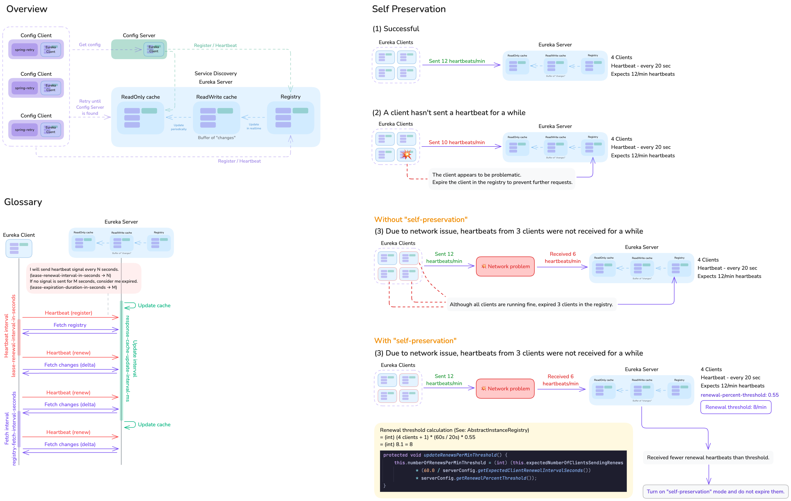

# Service Discovery - Eureka

## Flow



## Things to keep in mind

To make clients discover the configuration server before they start,
you need to set some properties and add a dependency.

**Properties:**

```yaml
spring:
  # Make sure to specify `optional:`.
  config.import: "optional:configserver:"
  cloud.config:
    # Find the configuration server via service discovery.
    discovery:
      enabled: true
      service-id: config
    # Retry policy
    retry:
      initial-interval: 1000
      max-attempts: 6
      max-interval: 16000
      multiplier: 2.0
    # Prevents the application from running
    # until all configuration information is obtained through retries.
    fail-fast: true
```

**Dependency:**

```kotlin
    implementation("org.springframework.retry:spring-retry")
```

## Eureka Server Profile

- For development: `development`
- For production:
  - `single`: For standalone Eureka server
  - `cluster`: For Eureka server cluster