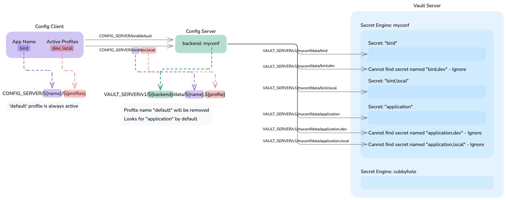

# Spring Cloud Config

## Flow



## How to configure Vault

### Initialization

```shell
vault operator init -key-shares=3 -key-threshold=2
```

With above command, you can get the `Unseal Key` and `Initial Root Token`.
Save them in a secure place.

Now, you can unseal the Vault server:

```shell
vault operator unseal
```

To proceed the following steps,
you'll may need to login with the `Initial Root Token`:

```shell
vault login
``` 

### ACL Policy

Create a policy to grant the access to the secret engine.

For example:

```text
path "${SecretEngine}/data/*" {
    capabilities = ["read", "list"]
}
```

To create with the Vault CLI:

```shell
POLICY_NAME=YOUR_POLICY_NAME
SECRET_ENGINE=YOUR_SECRET_ENGINE

vault policy write ${POLICY_NAME} -<<EOF
path "${SECRET_ENGINE}/data/*" {
    capabilities = ["read", "list"]
}
EOF

# Check the policy
vault policy read ${POLICY_NAME}
```

### Access

Create a token to access the Vault server.

> [!NOTE]
> Make sure to set the ACL policy name in the "Generated Token's Policies".

```shell
TOKEN_POLICY=YOUR_POLICY_NAME

# Create a token and save it in a secure place
vault token create -policy=${TOKEN_POLICY}
```

### Secret Engine

Secret Engine correspond to the `backend` in `application.yaml`.

```shell
SECRET_ENGINE=YOUR_SECRET_ENGINE

# Enable the Secret Engine
vault secrets enable -path=${SECRET_ENGINE} kv-v2
```

#### Secret

Create a secret in the Secret Engine.

Path of the secret should be:

```shell
# For shared configuration
application

# For shared configuration with the profile
# Listing multiple profiles will not work.
application,${Profile}

# For the application-specific configuration
${ApplicationName}

# For the application-specific configuration with the profile
# Listing multiple profiles will not work.
${ApplicationName},${Profile}
```

> [!NOTE]
> You can change `,` to other characters by setting
> `spring.cloud.config.server.vault.profile-separator` in `application.yaml`.

To create a secret with the Vault CLI:

```shell
SECRET_ENGINE=YOUR_SECRET_ENGINE
SECRET_PATH=YOUR_SECRET_PATH

vault kv put ${SECRET_ENGINE}/${SECRET_PATH} \
    key1=value1 \
    key2=value2 \
    ...
```

## Full Example

```shell
# Run the Vault server
docker compose up -d

# Open the shell of the Vault container
docker compose exec -it vault /bin/sh

# =========
# Variables
# =========

UNSEAL_KEY_SHARES=3
UNSEAL_KEY_THRESHOLD=2
POLICY_ADMIN=admin
POLICY_READONLY=readonly
SECRET_ENGINE=app

# Initialize the Vault server
vault operator init \
    -key-shares=${UNSEAL_KEY_SHARES} \
    -key-threshold=${UNSEAL_KEY_THRESHOLD}

# ============================================================
# Don't forget to save the Unseal Keys and Initial Root Token.
# ============================================================

# Unseal the Vault server
vault operator unseal # (1/2)
vault operator unseal # (2/2)

# Login with the Initial Root Token
vault login

# Create a policy - admin
vault policy write ${POLICY_ADMIN} /vault/policies/admin.hcl
vault policy read ${POLICY_ADMIN}

# Create a user account for admin
vault auth enable userpass
read -s ADMIN_PASSWORD && vault write auth/userpass/users/admin \
    token_policies=${POLICY_ADMIN} \
    password=${ADMIN_PASSWORD}

# Create a policy - readonly
vault policy write ${POLICY_READONLY} /vault/policies/readonly.hcl
vault policy read ${POLICY_READONLY}

# Create a token for Spring Cloud Config Server
vault token create -policy=${POLICY_READONLY}

# =================================================
# Don't forget to save the token in a secure place.
# =================================================

# Enable the Secret Engine
vault secrets enable -path=${SECRET_ENGINE} kv-v2

# Clean up variables
unset UNSEAL_KEY_SHARES \
    UNSEAL_KEY_THRESHOLD \
    POLICY_ADMIN \
    POLICY_READONLY \
    SECRET_ENGINE \
    ADMIN_PASSWORD

# logout
rm ~/.vault-token

# ===========================================
# Login via userpass and create some secrets.
#
# Login:
#   vault login -method=userpass username=USERNAME
#  
# Create a secret:
#   vault kv put -mount=SECRET_ENGINE SECRET_PATH key1=value1 key2=value2 ...
#    
# Read a secret:
#   vault kv get -mount=SECRET_ENGINE SECRET_PATH
#    
# Logout:
#   rm ~/.vault-token
# ===========================================
```

## Why Spring Cloud Config Server?

I've considered between:

- Config Client connects to:
  1. Private Git repository + Config Server(Git) 
  2. Vault server directly
  3. Vault server + Config Server(Vault)

and **chose the third option**.

At first, I thought that the first option would be the best choice because it's familiar to me.
However, when it comes to thinking about the security, it gets complicated.
It's hard to **fine-grain the access control** with the Git repository backend.

So, I decided to use the Vault server. This made me to think about the second option.
But since it **couples the client with the Vault server**, I chose the third option.

By using Spring Cloud Config Server with Vault,
I can switch the backend storage in the future **without changing the client code**.
